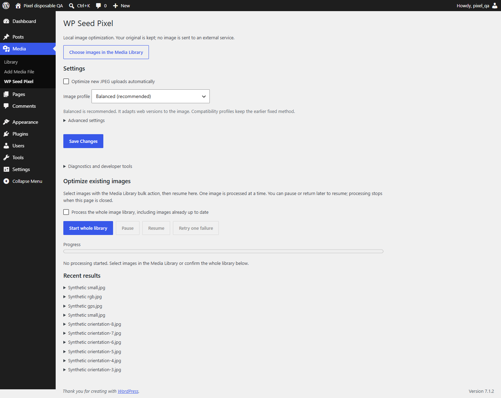
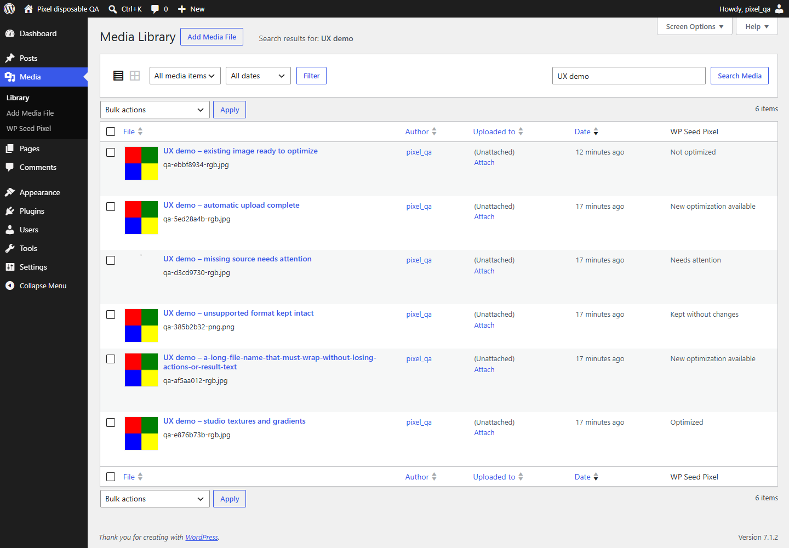
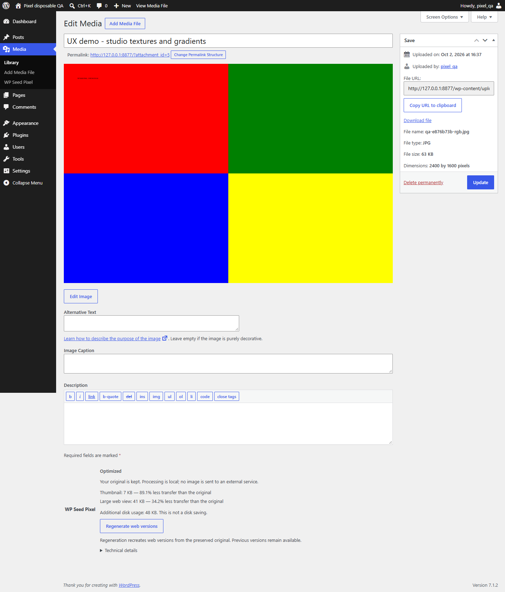
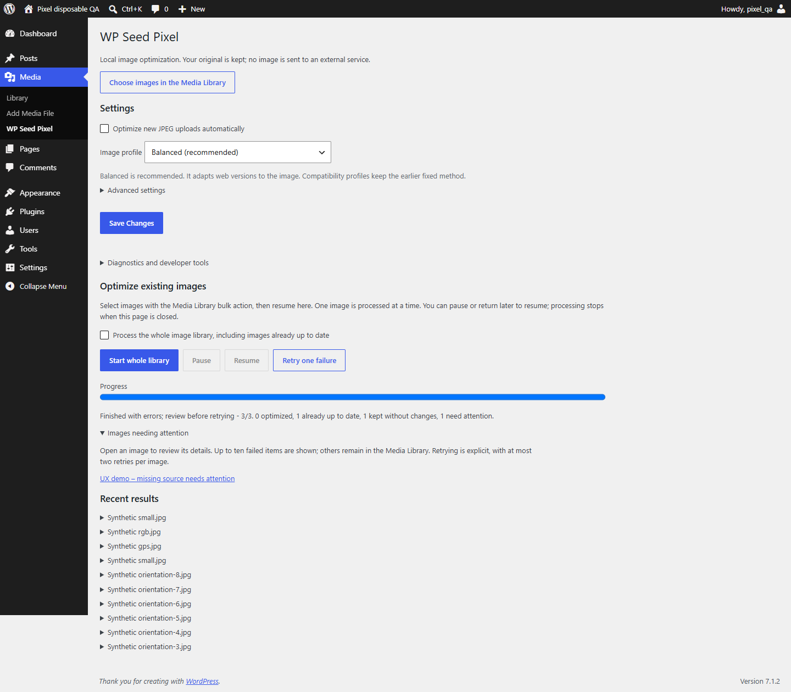

# WP Seed Pixel 0.4.0 (private V1 candidate)

Accepted storage milestones share one coordinator: analyze, explicitly plan
selected media, verify native JPEG/PNG replacement, retain a private original,
restore exactly, or explicitly delete that version permanently. Future uploads
are OFF by default and only enroll after administrator opt-in and a fresh cutoff.
0.3.x derivative APIs and generation identity remain compatible.

Read [V1 user guide](docs/V1-USER-GUIDE.md), [lossless PNG](docs/PNG-LOSSLESS.md),
[host hardening](docs/STORAGE-HOST-HARDENING.md) and the compatibility limits.
This is not a public release or permission for another consumer deployment.
Earlier milestone descriptions below are historical.

M5.1 development candidate: database-session ownership replaces authoritative
flock; optional byte-valued operational ceiling and explicitly opted-in future
JPEG jobs reuse M2-M5. See [host hardening](docs/STORAGE-HOST-HARDENING.md).
This does not change the public 0.3.2 version or enable processing on upgrade.

Local, non-destructive JPEG optimization for the WordPress Media Library.
No cloud upload, service quota, AI runtime or telemetry. The original is kept.
Use automatic uploads, individual actions or selected bulk processing, with a
bounded local Adaptive strategy. No extra runtime package or second library.

**0.3.0 is a Tech Preview.** Owner acceptance passed; this is not a universal
production certification. Review [tested compatibility](docs/COMPATIBILITY.md)
and back up the site before a pilot.

## Install

The 0.3.1 ICC fix is an unpublished local candidate. Install only an explicitly
certified artifact after a targeted backup; it is not a new public release yet.
Download that installable asset from the GitHub release, not GitHub's automatic
Source code ZIP or tar.gz archives.
Activate on one site. Open Media > WP Seed Pixel. Automatic processing defaults
to OFF. Back up the database and uploads before a library-wide batch.

Choose an image in Media > Library and use **Optimize with WP Seed Pixel**.
Native attachment details in list and grid show status, benefit and optional
technical details. **Regenerate web versions** uses the preserved original.
For several images, use the list view bulk action, then **Resume** on the Pixel
page. A selection is capped at 1000 items; larger libraries can use several
selections or the separate explicitly confirmed whole-library action.
A batch processes one attachment per authenticated POST and can be paused,
resumed after reload, and retried twice per failed attachment. Keep the admin
page open to advance it; this is not a background worker daemon.
Image buttons and batch progress require JavaScript. Settings and the diagnostic
single-image fallback work without it. Numeric IDs are confined to developer
tools, not normal use. Frontend rendering does not require JavaScript.

## Presets

| Preset | Derivatives | JPEG quality |
| --- | --- | --- |
| balanced (new installation default) | THUMB 640; VIEW target 1920 | local quality/byte selection, source reuse |
| web (legacy/API default) | maximum 1600 x 1600, proportional | 82 |
| participant_album (example) | THUMB maximum 640; VIEW maximum 2048 | 80; 90 |

No cropping, enlargement, sharpening or aesthetic alteration. Preset dimensions
are upper bounds, not promised square outputs. Both derivatives come from the
master independently, never from a previous compressed derivative.

**Smaller transfer is not guaranteed.** A Q90 re-encode can be larger than an
already-compressed source. The result reports negative transfer savings honestly.
Disk use can increase because the master and native WordPress sizes remain.

The recommended `balanced` intent tries at most three independent qualities
per output, checks sampled local structure and RGB error, and retains a safe
MASTER when encoding has no material gain. It never exposes an original carrying
private metadata. A reused resource has `kind=master`, `quality=null` and adds
zero disk bytes; it is not a duplicate file. A source retained after quality
rejection can exceed the dimension/soft weight target. See [algorithm](docs/ADAPTIVE-ALGORITHM.md).
Existing settings and fixed/custom profiles stay unchanged on upgrade. Select
Balanced explicitly to regenerate existing images; there is no upgrade-wide batch.
The quality metric is a bounded heuristic, not a human visual certification.

## Safety and compatibility

- WordPress `WP_Image_Editor` selects its existing GD or Imagick backend.
- Ordinary, unprofiled three-channel RGB JPEGs are supported. EXIF rotation and
  mirrored orientations require PHP EXIF. Sensitive metadata is removed from
  outputs; the fixed technical GD/JPEG encoder comment can remain.
- Validated RGB ICC JPEGs require Imagick with LittleCMS. The embedded source
  profile is transformed to bundled standard sRGB in a lossless, oriented working
  PNG before resizing or quality scoring. Only after conversion are private
  metadata removed. The original JPEG is never modified or reused as an output.
- GD-only ICC, invalid/incomplete profiles, unprofiled non-sRGB declarations,
  CMYK and grayscale fail closed. sRGB conversion may clip out-of-gamut colors;
  this does not promise preservation of the original wide gamut on every display.
- PNG, GIF (including animation), WebP, AVIF and SVG are skipped, not overwritten.
- Source files must be regular local files inside this site's uploads directory,
  without symlink components. Remote/offloaded/private external storage is not
  supported by this release; this plugin is not a private-album access-control system.
- Preflight limits: 40 megapixels, 64 MB source, bounded JPEG header, estimated
  decode memory and staging disk budget. Host resource failures remain possible.
- File locks and metadata compare-and-swap prevent two Pixel jobs and concurrent
  metadata overwrites. Foreign metadata filters cause a safe refusal.
- Other optimizers are neither disabled nor rewritten. Coexistence with each
  commercial optimizer requires a separate real-site validation.
- PHP minimum 8.1, WordPress minimum 6.6 are declared API floors, not an assertion
  that every combination was tested. See [compatibility](docs/COMPATIBILITY.md).
- Network activation is refused. Per-site multisite behavior is not certified.

## Deactivation and removal

Deactivation stops automation and pauses a running batch; masters and outputs
remain. Default uninstall retains generated files and settings. Optional cleanup
removes only proven-owned, hash-matching, unreferenced derivatives and plugin
metadata. Shared or changed files are retained conservatively. WordPress itself
deletes its original when the user explicitly deletes an attachment.

Interrupted output publication leaves a journal. The next job for that attachment
recovers it under the lock. A crash does not replace the previous valid generation.
Previously published URLs remain stored, including after regeneration, to avoid
breaking static/cached HTML. A maximum of twenty previous generations is kept;
further regeneration stops until explicitly reviewed/pruned with the PHP API.
Disk growth includes these retained generations. Never prune before reviewing
external and cached uses; database reference checks cannot see a CDN cache.
Locks are persistent empty synchronization files, not active processes. Do not
manually remove locks while workers may be running.

## Documentation

- [Architecture](docs/ARCHITECTURE.md)
- [PHP API and hooks](docs/API.md)
- [Development and tests](docs/DEVELOPER.md)
- [Roadmap](docs/ROADMAP.md)
- [External album integration example](docs/INTEGRATION-EXAMPLE-ALBUMS.md)
- [Compatibility](docs/COMPATIBILITY.md)
- [Contributing](CONTRIBUTING.md)
- [Security](SECURITY.md)

Image-engine visual review passed for 0.2.0; 0.3.1 adds bounded RGB ICC handling.
The 0.3.0 admin UX passed owner acceptance, not a production certification.
Imagick/LittleCMS ICC checks now pass locally on Windows; Linux,
MySQL/MariaDB and multisite remain uncertified. English source strings
are translatable; a French catalogue is not shipped yet.

## Administration screenshots

These are real local WordPress screens with generated synthetic media only.

### Settings

### Media Library

### Attachment details

### Selected bulk result

## License

GPL-2.0-or-later; see [LICENSE](LICENSE). No third-party code, font, image
corpus or licensed WordPress theme is bundled. Synthetic fixtures and public
screenshots are original project test material, distributed under the same license.

## Private V1 packaging

The 0.4.0 candidate is not a public release. Its runtime-only build is
`python -B tests/v1-package.py`, gated on two identical frozen clean-cycle
manifests. It writes only into ignored `reports/storage-v1/`, excludes docs,
screenshots, tests and lab data, and never replaces the public 0.3.2 ZIP.
Do not use the historical general release packager for this candidate.
